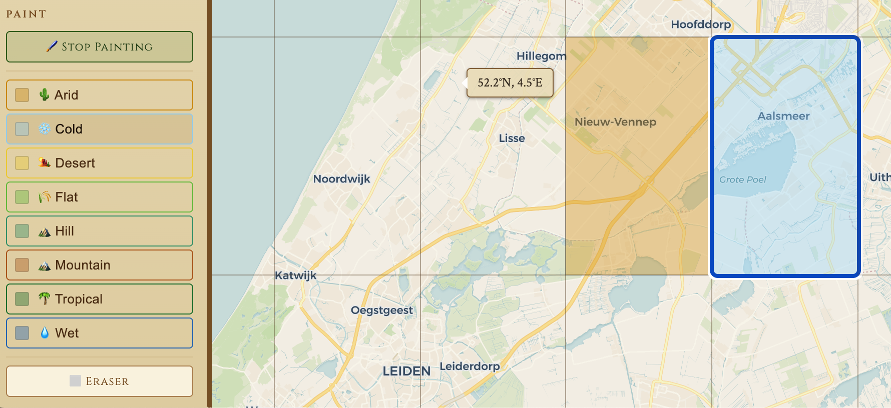
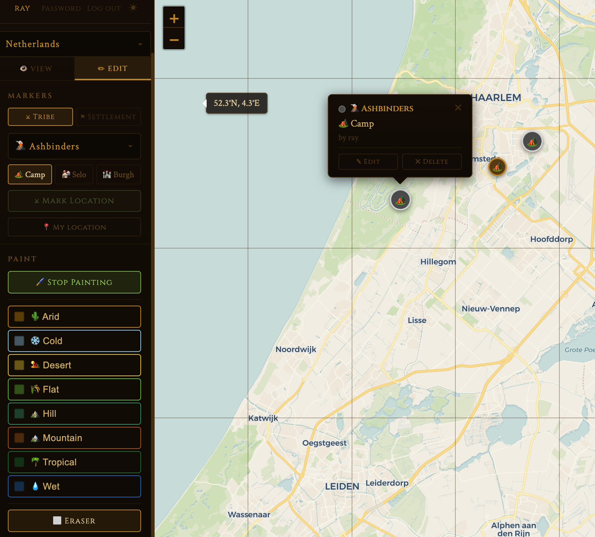
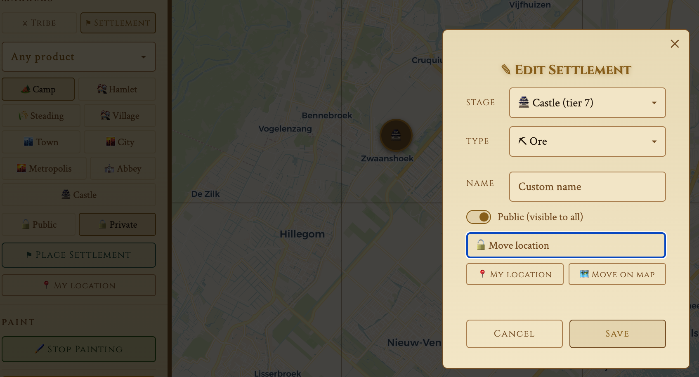
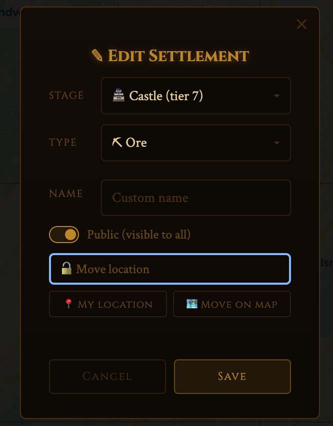
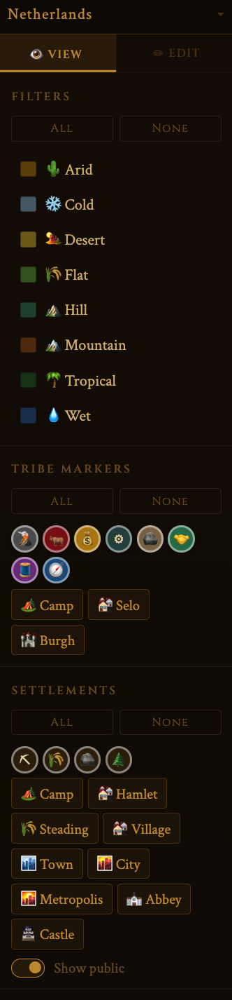
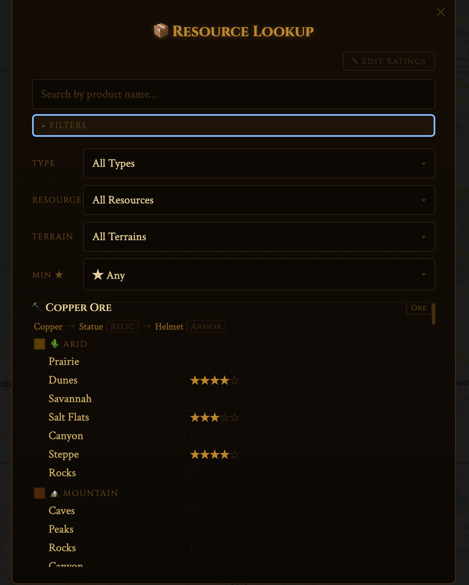

# Features

Merchant Companion is a shared map tool for Merchants of the Dark Road. By default, all users see the same map — terrain painted by one person is visible to everyone in that region, and public settlements are shared across players. Terrain paint, tribe marker visibility, and star ratings can each be switched between shared and private-per-user by the server operator — see [Installation](installation.md#configuration).

---

## Region navigation

Use the dropdown at the top of the sidebar to select a country. If the country has sub-regions (like US states), a second dropdown appears. The map pans and zooms to fit the selected region automatically.

Your last-used region is saved to your account and restored when you log in on any device.

---

## Terrain painting

Switch to the **Edit** tab and select a terrain type from the paint swatches. The map switches to paint mode — click or drag over cells to colour them. Click **Stop Painting** to exit paint mode.

Available terrain types: Arid, Cold, Desert, Flat, Hill, Mountain, Tropical, Wet.

Use the **Eraser** to remove paint from a cell.

Painted terrain is visible to all users in that region (unless the server is configured for private-per-user paint).

---

## Tribe markers

Track where tribes are located on the map.

**Placing a marker:**
1. Go to **Edit → Markers → Tribe**
2. Select a tribe from the dropdown
3. Select the settlement tier: Camp, Selo, or Burgh
4. Click **Mark Location** and click on the map

**Editing or deleting a marker:**
Click any of your markers on the map to open a popup with Edit and Delete options.

Each account can place up to 50 tribe markers. Tribe markers are private by default — only you see them — unless the server is configured to make them visible to everyone. You can only edit or delete your own markers either way.

---

## Settlements

Track your own settlements with stage, resource type, and name.

**Placing a settlement:**
1. Go to **Edit → Markers → Settlement**
2. Choose a resource type filter (optional — narrows the stage grid)
3. Select the settlement stage (Camp through Castle)
4. Choose **Public** or **Private**
5. Click **Place Settlement** and click on the map

**Editing a settlement:**

Click a marker to open its popup, then click **Edit** to change the stage, resource type, name, or visibility. You can also move it by clicking **Move on map** or snap it to your GPS location with **My Location**.

**Public vs private:**
- **Public** settlements are visible to all logged-in users (up to 10 per account)
- **Private** settlements are visible only to you (up to 50 total per account)

---

## Filters

The **View** tab shows filter controls for everything on the map:

- **Terrain** — toggle individual terrain types on/off, or use All/None
- **Tribe markers** — filter by tribe icon or by settlement tier (Camp/Selo/Burgh)
- **Settlements** — filter by resource type or settlement stage; toggle public settlements

Filters are applied locally and do not affect what other users see.

---

## Resource lookup

Click the resource icon in the sidebar to open the Resource Lookup modal.

**Finding resources:**
- Search by product name (searches name, type, and production chain)
- Filter by resource type, specific resource, terrain, or minimum star rating

**Reading results:**
Each resource shows its production chain (raw → processed → final products) and a list of terrain types and specific locations where it can be found, grouped by terrain.

**Star ratings:**
Locations can be rated 1–5 stars by the community. A rating of 0 means unknown. Log in and click **Edit Ratings** to contribute ratings. By default ratings are shared across all users (the latest submission wins); the server can instead be configured so each user only sees their own rating.

---

## Theme

The app supports dark and light themes. Click the moon/sun icon in the sidebar header to toggle. Your preference is saved in the browser.

---

## Account

- **Register** — create an account (registration may be open, allowlist-only, or closed depending on server config)
- **Login / Logout** — sessions are stored in a secure HttpOnly cookie, valid for 24 hours
- **Change password** — available from the sidebar when logged in
- **Region preference** — your selected region is saved to your account automatically
